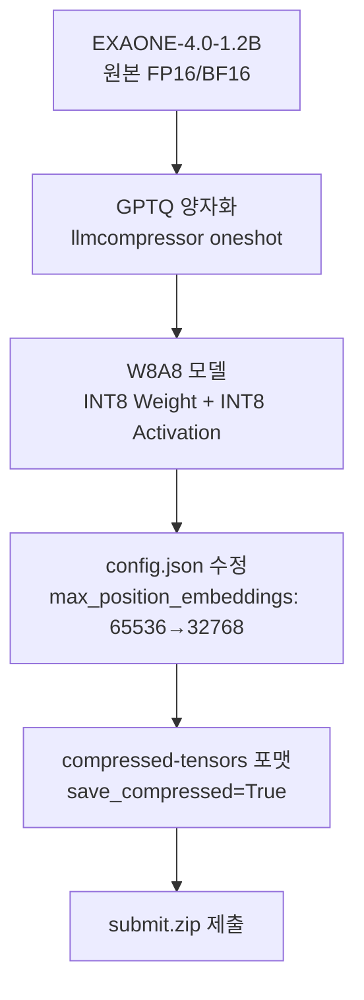
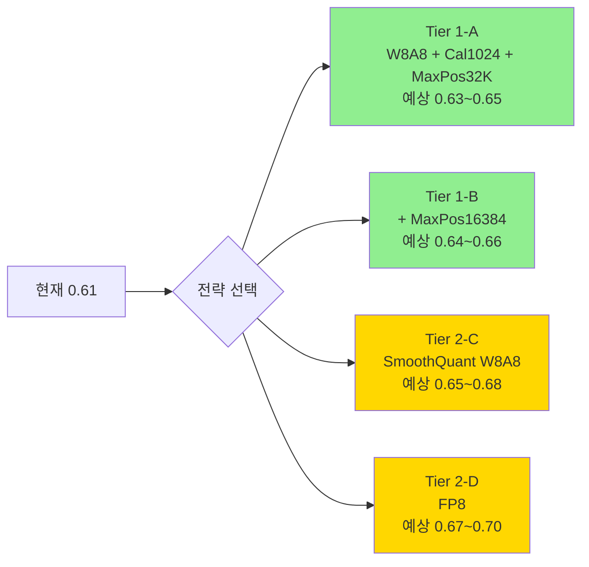

# 98_seokbun_0.61.py 분석 및 경량화 전략 리포트

## 1. 대회 평가 산식 (Scoring Formula)

$$Score = \max(0.5 \times PerfNorm + 0.5 \times SpeedNorm, \; 0)$$

| 항목 | 산식 | 의미 |
|------|------|------|
| **PerfNorm** | $\frac{Perf_{model}}{Perf_{base}}$ |기본 모델 대비 **정확도 비율** (1.0 = 동일, 낮을수록 손실) |
| **SpeedNorm** | $1 - \frac{Time_{model}/Tokens_{model}}{Time_{base}/Tokens_{base}}$ | 기본 모델 대비 **토큰당 추론 시간 감소율** (높을수록 빠름) |

> [!IMPORTANT]
> **정확도 50% + 속도 50%** 동일 가중치. 둘 다 최적화해야 높은 점수를 받을 수 있음.

### 점수 해석 예시

| PerfNorm | SpeedNorm | Score | 해석 |
|----------|-----------|-------|------|
| 1.0 | 0.0 | 0.50 | 정확도 유지, 속도 동일 |
| 0.95 | 0.30 | 0.625 | 약간 정확도 손실, 30% 빠름 |
| 0.90 | 0.50 | 0.70 | 10% 정확도 손실, 50% 빠름 |
| **0.82** | **0.40** | **≈0.61** | 💡 [98_seokbun_0.61.py](file:///c:/Users/htw02/project_github/lg_aimers/99_code/98_seokbun_0.61.py) 추정 |

---

## 2. 평가 서버 환경

| 항목 | 사양 |
|------|------|
| **OS** | Ubuntu 22.04.5 LTS |
| **CPU** | 6 vCPU |
| **RAM** | 28GB |
| **GPU** | **NVIDIA L4** (VRAM 22.4 GiB) |
| **Python** | 3.11.14 |
| **CUDA** | 12.8 |
| **추론 엔진** | **vLLM 0.14.1** |
| **양자화 포맷** | **compressed-tensors 0.13.0** |
| **시간 제한** | 전체 추론 20분 이내 |
| **파일 크기** | ZIP ≤ 10GB (압축 해제 후 ≤ 32GB) |

### vLLM 서빙 옵션 (고정)

```
tensor_parallel_size = 1
gpu_memory_utilization = 0.85
batch_size = auto
max_gen_toks = 16384
apply_chat_template = true
```

### 핵심 패키지

| 패키지 | 버전 | 역할 |
|--------|------|------|
| `torch` | 2.9.0+cu128 | PyTorch |
| `transformers` | 4.57.3 | 모델 로더 |
| `vllm` | 0.14.1 | 추론 엔진 |
| `compressed-tensors` | 0.13.0 | 양자화 모델 포맷 |
| `safetensors` | 0.7.0 | 모델 가중치 저장 |

---

## 3. [98_seokbun_0.61.py](file:///c:/Users/htw02/project_github/lg_aimers/99_code/98_seokbun_0.61.py) 사용 경량화 기법 분석

### 사용 기법: **GPTQ W8A8 + KV Cache 최적화**



### 핵심 파라미터 설정 및 영향도

| 파라미터 | 설정값 | 영향 | 상세 분석 |
|----------|--------|------|-----------|
| **SCHEME** | `W8A8` | ⭐⭐⭐ 정확도+속도 | 가중치 8bit + 활성화 8bit → **정확도 손실 최소화**, W4A16보다 정확하지만 압축률 낮음 |
| **NUM_CALIBRATION_SAMPLES** | `512` | ⭐⭐ 정확도 | 캘리브레이션 샘플 수. 256→512 증가. 양자화 품질 향상 |
| **MAX_SEQUENCE_LENGTH** | `1024` | ⭐⭐ 정확도 | 캘리브레이션 시퀀스 길이. 긴 컨텍스트 패턴도 학습 |
| **DAMPENING_FRAC** | `0.01` | ⭐ 정확도 안정성 | GPTQ Hessian 대각 댐핑. 양자화 안정성 향상 |
| **TARGETS** | `["Linear"]` | 양자화 대상 | 모든 Linear 레이어 양자화 |
| **IGNORE** | `["embed_tokens", "lm_head"]` | ⭐⭐ 정확도 보존 | 임베딩/출력 레이어 제외 → 정확도 보호, 속도는 미세 감소 |
| **MAX_POSITION_EMBEDDINGS** | `32768` (원래 65536) | ⭐⭐⭐ 속도 | KV Cache 메모리 50% 절감 → vLLM 배치 크기 ↑ → 추론 속도 ↑ |
| **torch_dtype** | `bfloat16` | 양자화 입력 | 양자화 전 모델 정밀도 |

### 왜 0.61 점수가 나왔나? (추정 분석)

**강점 (속도):**
- **W8A8**: INT8 연산은 L4 GPU의 INT8 Tensor Core 활용 가능 → FP16 대비 추론 속도 향상
- **max_position_embeddings 축소**: KV Cache 메모리 절감으로 vLLM이 더 큰 배치 처리 가능

**약점 (정확도 vs 속도 트레이드오프):**
- **W8A8의 한계**: 8bit는 4bit 대비 압축률이 낮아 모델 크기가 큼 → 메모리 사용 ↑, 로딩 시간 ↑
- **actorder 미사용**: 활성화 순서 기반 양자화를 사용하지 않아 정확도 최적화 부족
- 하지만 W8A8의 높은 정확도가 PerfNorm에서 유리하게 작용

---

## 4. 다른 코드들과의 비교

| 코드 | 점수 | Scheme | Calibration | SeqLen | ActOrder | max_pos | 특징 |
|------|------|--------|-------------|--------|----------|---------|------|
| **98_seokbun** | **0.61** | **W8A8** | **512** | **1024** | **없음** | **32768** | **INT8 양자화 + KV 최적화** |
| 11_0.62_code | 0.62 | W8A8 | 1024 | 512 | 없음 | 없음(?) | 캘리브레이션 샘플 2배 |
| 99_taehun | 0.60 | W4A16 | 512 | 1024 | dynamic | 32768 | 4bit + actorder |
| 00_sample_local | 0.57 | W4A16 | 256 | 512 | static | 없음 | 기본 설정 |
| 12_autoround | ? | W4A16 | 1024 | 512 | AutoRound | 없음 | AutoRound 기법 |

> [!NOTE]
> **11_0.62_code.py (Score 0.62)** 가 가장 높은 점수로, `98_seokbun`과 동일한 W8A8이지만 calibration_samples를 1024로 더 늘렸음. 단, max_position_embeddings 수정은 없는 것으로 보임.

### 핵심 인사이트

1. **W8A8 > W4A16**: 이 대회에서는 W8A8이 W4A16보다 높은 점수 → **정확도 보존이 매우 중요**
2. `11_0.62_code`는 calibration 1024 + seq_len 512 조합으로 0.62 달성 → **캘리브레이션 품질이 핵심**
3. **max_position_embeddings 축소는 속도에 효과적**이지만, 11_0.62_code는 이걸 안 해도 0.62 달성

---

## 5. 더 좋은 경량화 기법 제안

### 🏅 Tier 1: 즉시 적용 가능 (현재 코드 기반)

#### A. W8A8 + 캘리브레이션 강화 + max_pos 최적화 조합

```python
# 11_0.62_code의 장점(cal 1024) + 98_seokbun의 장점(max_pos 축소) 결합
NUM_CALIBRATION_SAMPLES = 1024  # 512 → 1024 (정확도 ↑)
MAX_SEQUENCE_LENGTH = 1024      # 512 유지가 아닌 1024 (긴 컨텍스트 ↑)
MAX_POSITION_EMBEDDINGS = 32768  # KV Cache 50% 절감 (속도 ↑)
DAMPENING_FRAC = 0.01           # 양자화 안정성
```

> 예상: **0.62~0.65** (두 코드의 장점 결합)

#### B. max_position_embeddings를 16384로 더 공격적 축소

```python
MAX_POSITION_EMBEDDINGS = 16384  # max_gen_toks=16384와 동일하게
```

> vLLM의 `max_gen_toks = 16384`이므로 실제로 16384 이상의 컨텍스트가 필요하지 않을 수 있음 → **KV Cache 75% 절감**
>
> ⚠️ 단, 벤치마크 데이터가 16384 토큰을 넘는 경우 오류 발생 가능

---

### 🥈 Tier 2: 고급 기법 (코드 수정 필요)

#### C. SmoothQuant (W8A8 개선)

```python
from llmcompressor.modifiers.smoothquant import SmoothQuantModifier
from llmcompressor.modifiers.quantization import QuantizationModifier

recipe = [
    SmoothQuantModifier(smoothing_strength=0.5),  # 활성화 이상값 평활화
    QuantizationModifier(
        scheme="W8A8",
        targets="Linear",
        ignore=["embed_tokens", "lm_head"],
    )
]
```

- GPTQ 없이 **SmoothQuant + 정적 양자화** 조합
- 활성화 이상값(outlier)을 가중치로 이동 → **INT8 활성화 양자화 품질 ↑**
- vLLM이 INT8 W8A8를 네이티브 지원하므로 속도 이점 유지

#### D. FP8 양자화 (L4 GPU 지원 확인 필요)

```python
SCHEME = "FP8"  # FP8 E4M3 가중치 + FP8 E5M2 활성화
```

- **L4 GPU는 FP8 Tensor Core를 지원** (Ada Lovelace 아키텍처)
- INT8보다 더 높은 정확도 + 동등한 속도
- ⚠️ `compressed-tensors 0.13.0`과 `vllm 0.14.1`의 FP8 지원 여부 확인 필요

#### E. Mixed-Precision (중요 레이어만 고정밀도)

```python
# 첫/마지막 몇 개 레이어는 FP16 유지, 나머지만 INT8
recipe = [
    GPTQModifier(
        scheme="W8A8",
        targets="Linear",
        ignore=[
            "embed_tokens", "lm_head",
            "model.layers.0.*",   # 첫 레이어 FP16 유지
            "model.layers.1.*",
            "model.layers.23.*",  # 마지막 레이어 FP16 유지
        ],
    )
]
```

- 정확도에 민감한 레이어를 보호하면서 전체 속도 유지

---

### 🥉 Tier 3: 실험적 (위험도 높음)

| 기법 | 기대 효과 | 위험 |
|------|-----------|------|
| **AWQ (Activation-aware Weight Quantization)** | W4A16에서 GPTQ보다 높은 정확도 | `compressed-tensors` 포맷 호환성 |
| **AQLM (Additive Quantization)** | 2bit까지 가능, 극한 압축 | vLLM 지원 미확인 |
| **Knowledge Distillation + 양자화** | 양자화 전 KD로 정확도 보강 | 별도 학습 필요, 시간 소요 |
| **Pruning + 양자화** | 모델 크기 추가 감소 | 구조 변경 시 vLLM 비호환 |

---

## 6. 최종 권장 전략 (점수 최대화)



### 즉시 실행 가능한 최적 조합

```python
# 🎯 추천: 98_seokbun + 11_0.62_code 장점 결합
SCHEME = "W8A8"
NUM_CALIBRATION_SAMPLES = 1024    # ← 512에서 증가 (11_0.62_code의 설정)
MAX_SEQUENCE_LENGTH = 1024        # 유지
DAMPENING_FRAC = 0.01             # 유지
IGNORE = ["embed_tokens", "lm_head"]
MAX_POSITION_EMBEDDINGS = 32768   # KV Cache 축소 (속도 ↑)
```

> [!TIP]
> 제출 횟수가 하루 3회로 제한되므로, **Tier 1-A를 먼저 시도**한 후 결과에 따라 Tier 1-B 또는 Tier 2로 진행하는 것이 안전합니다.
