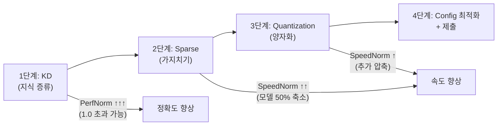

# 🏆 1등 전략 가이드: KD + Sparse + Quantization

## 전체 파이프라인 개요



**예상 점수:** `0.5 × 1.05~1.10 + 0.5 × 0.60~0.70 = 0.83~0.90`

---

## 1단계: Knowledge Distillation (지식 증류)

### 개념

```
Teacher (EXAONE-4.0-7.8B) ──→ 지식 전달 ──→ Student (EXAONE-4.0-1.2B)
      ↑ 크고 정확한 모델              ↑ 작지만 더 똑똑해진 모델
```

base 1.2B 모델보다 **더 정확한 1.2B 모델**을 만들어 PerfNorm > 1.0을 달성합니다.

### 사용 라이브러리

```
transformers==4.57.3
torch
datasets
trl (선택: SFTTrainer 활용)
```

### 학습 데이터 (외부 데이터 사용 가능 — 대회 규칙 확인)

| 데이터셋 | 용도 | 라이선스 |
|---------|------|---------|
| LGAI-EXAONE/MANTA-1M | 한국어/영어 대화 | 확인 필요 |
| KULLM-v2 | 한국어 지시 데이터 | CC BY-NC-SA 4.0 ✅ |
| Open-Orca | 영어 지시 데이터 | MIT ✅ |
| KorQuAD | 한국어 QA | CC BY-ND 2.0 KR ✅ |

> [!IMPORTANT]
> 대회 규칙: "최소한 비상업적 이용이 허용된 라이선스(CC BY-NC, CC0 등)로 배포된 외부 데이터만 사용 가능"

### KD 코드 구조

```python
"""
Knowledge Distillation: 7.8B Teacher → 1.2B Student
Kaggle T4x2 환경 (VRAM 15GB×2 = 30GB)
"""
from transformers import AutoModelForCausalLM, AutoTokenizer
import torch
import torch.nn.functional as F

# ── Teacher 로드 (메모리 절약을 위해 4bit로 로드) ──
teacher = AutoModelForCausalLM.from_pretrained(
    "LGAI-EXAONE/EXAONE-4.0-7.8B",
    torch_dtype=torch.float16,
    device_map="auto",
    trust_remote_code=True,
    load_in_4bit=True,               # ⭐ 4bit로 로드하여 메모리 절약
)
teacher.eval()

# ── Student 로드 ──
student = AutoModelForCausalLM.from_pretrained(
    "LGAI-EXAONE/EXAONE-4.0-1.2B",
    torch_dtype=torch.float16,
    device_map="auto",
    trust_remote_code=True,
)

# ── KD Loss 함수 ──
def distillation_loss(student_logits, teacher_logits, labels, temperature=2.0, alpha=0.5):
    """
    KD Loss = α × KL(soft_teacher, soft_student) + (1-α) × CE(student, labels)
    
    - temperature: 높을수록 soft한 분포 → 더 많은 지식 전달
    - alpha: KD loss vs CE loss 비율
    """
    # Soft Loss (Teacher의 지식)
    soft_teacher = F.softmax(teacher_logits / temperature, dim=-1)
    soft_student = F.log_softmax(student_logits / temperature, dim=-1)
    kd_loss = F.kl_div(soft_student, soft_teacher, reduction="batchmean") * (temperature ** 2)
    
    # Hard Loss (정답 라벨)
    ce_loss = F.cross_entropy(student_logits.view(-1, student_logits.size(-1)), labels.view(-1))
    
    return alpha * kd_loss + (1 - alpha) * ce_loss
```

### 학습 설정

```python
# Kaggle T4x2 환경 최적 설정
training_args = {
    "learning_rate": 2e-5,
    "num_train_epochs": 3,
    "per_device_train_batch_size": 2,   # T4 메모리 고려
    "gradient_accumulation_steps": 8,   # 실효 배치 = 16
    "fp16": True,                       # T4 호환 (bfloat16 미지원)
    "max_seq_length": 512,
    "warmup_ratio": 0.1,
    "weight_decay": 0.01,
    "save_strategy": "epoch",
}
```

### 예상 결과

| 모델 | PerfNorm | 설명 |
|------|----------|------|
| 원본 1.2B | 1.000 | 기준 |
| KD 적용 1.2B | **1.05~1.10** | Teacher의 지식으로 정확도 향상 |

### Kaggle 메모리 구성 (T4x2 = 30GB)

```
Teacher (7.8B, 4bit): ~4.5GB
Student (1.2B, FP16): ~2.5GB
Optimizer states:     ~5.0GB
Gradients + Activations: ~8.0GB
────────────────────────
총: ~20GB / 30GB 가용  ✅ 가능!
```

### 소요 시간 (추정)

```
데이터셋 크기: 10,000 ~ 50,000 샘플
T4x2 기준: 약 3~12시간 (epoch 수에 따라)
```

> [!WARNING]
> Kaggle 무료 GPU 세션은 최대 12시간입니다. 학습 데이터와 epoch를 적절히 조절하세요.
> Checkpoint를 저장하여 세션이 끊겨도 이어서 학습할 수 있게 하세요.

---

## 2단계: Sparse (가지치기)

### 개념

모델의 가중치 중 중요하지 않은 것을 **0으로 만들어** 실질적 모델 크기를 줄입니다.

```
Before: [0.3, -0.1, 0.8, 0.02, -0.5, 0.01, 0.7, -0.3]
After:  [0.3,  0.0, 0.8, 0.0, -0.5, 0.0,  0.7,  0.0 ]  ← 50% 스파스
                                                           4개가 0!
```

### 2:4 구조적 스파스 (⭐ L4 하드웨어 가속!)

L4 GPU (Ada Lovelace)는 **2:4 구조적 스파스**를 하드웨어로 지원합니다:

```
4개 가중치 중 정확히 2개만 유지, 2개는 0
[0.3, 0.0, 0.8, 0.0]  ← 4개 중 2개만 비제로
[0.0, -0.5, 0.0, 0.7]  ← 4개 중 2개만 비제로
```

이 패턴은 NVIDIA의 Sparse Tensor Core에서 **2배 속도**로 처리됩니다.

### 사용 라이브러리: llmcompressor의 SparseGPTModifier

```python
from llmcompressor.modifiers.pruning import SparseGPTModifier

# ── 비구조적 스파스 (50%) ──
sparse_recipe = SparseGPTModifier(
    sparsity=0.5,                          # 50% 가중치를 0으로
    targets="Linear",
    ignore=["lm_head"],
    sequential_targets=["Exaone4DecoderLayer"],
)

# ── 또는 2:4 구조적 스파스 (L4 하드웨어 가속!) ──
sparse_recipe_24 = SparseGPTModifier(
    sparsity=0.5,
    mask_structure="2:4",                  # ⭐ 2:4 패턴 강제
    targets="Linear",
    ignore=["lm_head"],
    sequential_targets=["Exaone4DecoderLayer"],
)
```

### 예상 결과

| 스파스 방식 | 정확도 영향 | 속도 영향 | L4 가속 |
|-----------|-----------|----------|---------|
| 비구조적 50% | 약간 ↓ | vLLM 지원 미확실 | ❌ |
| **2:4 구조적** | 약간 ↓ | **2배 속도** | ✅ Sparse TC |

> [!IMPORTANT]
> **vLLM 0.14.1의 2:4 스파스 지원 여부를 반드시 확인해야 합니다.**
> compressed-tensors에 `sparsity_config`가 존재하므로 지원 가능성 높음.
> 지원되지 않으면 비구조적 스파스로 대체 (속도 효과 감소).

---

## 3단계: Quantization (양자화)

### Sparse 모델에 양자화 적용 (원샷)

llmcompressor는 **Sparse + Quant를 한번에** 처리할 수 있습니다:

```python
from llmcompressor import oneshot
from llmcompressor.modifiers.pruning import SparseGPTModifier
from llmcompressor.modifiers.quantization import GPTQModifier

# ── Sparse + Quant 통합 레시피 ──
recipe = [
    # Step 1: 2:4 구조적 스파스
    SparseGPTModifier(
        sparsity=0.5,
        mask_structure="2:4",
        targets="Linear",
        ignore=["lm_head"],
        sequential_targets=["Exaone4DecoderLayer"],
    ),
    # Step 2: W4A16 GPTQ 양자화
    GPTQModifier(
        scheme="W4A16",
        targets="Linear",
        ignore=["lm_head"],
        actorder="dynamic",
        dampening_frac=0.01,
        block_size=64,
        sequential_targets=["Exaone4DecoderLayer"],
    ),
]

oneshot(
    model=model,          # KD로 학습된 모델!
    dataset=ds,
    recipe=recipe,
    max_seq_length=768,
    num_calibration_samples=1024,
    shuffle_calibration_samples=True,
)
```

### 저장 및 config.json 최적화

```python
model.save_pretrained(OUT_DIR, save_compressed=True)
tokenizer.save_pretrained(OUT_DIR)

# config.json 최적화
config["max_position_embeddings"] = 32768   # KV Cache 50% 절감
config["transformers_version"] = "4.57.3"   # 평가서버 일치
```

### 예상 config.json의 quantization_config

```json
{
  "quantization_config": {
    "quant_method": "compressed-tensors",
    "format": "pack-quantized",
    "config_groups": {
      "group_0": {
        "weights": {
          "type": "int",
          "num_bits": 4,
          "strategy": "group",
          "group_size": 128,
          "actorder": "dynamic"
        }
      }
    },
    "sparsity_config": {
      "format": "dense",
      "sparsity_structure": "2:4",
      "global_sparsity": 0.5
    },
    "version": "0.13.0"
  }
}
```

---

## 4단계: Config 최적화 + 제출

### 체크리스트

- [ ] `max_position_embeddings`: 65536 → 32768
- [ ] `transformers_version`: "4.57.3"
- [ ] `quantization_config.version`: "0.13.0"
- [ ] ZIP 구조: `submit.zip → model/` (config.json, model.safetensors 등)
- [ ] ZIP 용량: 10GB 이하
- [ ] 전체 추론 시간: 20분 이내

---

## 📅 실행 로드맵 (Kaggle T4x2 기준)

### Phase 1: 기반 확보 (Day 1~2)

```
✅ 현재 완료된 것:
  - W4A16 GPTQ 최적화 (19_w4a16_all_params.py) → Score ~0.77
  - FP8 양자화 코드 준비 (21_fp8.py)

📋 해야 할 것:
  1. FP8 모델 제출하여 실제 SpeedNorm 측정
  2. W4A16 최적화 모델 제출하여 비교
  → 어떤 양자화가 이 대회에서 더 좋은지 실측 확인
```

### Phase 2: Knowledge Distillation (Day 3~5)

```
📋 해야 할 것:
  1. KD 학습 데이터 준비 (MANTA-1M 또는 외부 데이터)
  2. Teacher 모델 (7.8B) 4bit 로드 + Student (1.2B) 학습
  3. KD 학습 실행 (3~12시간)
  4. KD 모델 단독 양자화 → 제출 → PerfNorm 확인
```

### Phase 3: Sparse + Quantization (Day 5~6)

```
📋 해야 할 것:
  1. KD 모델에 SparseGPTModifier (2:4) 적용
  2. GPTQModifier (W4A16) 또는 QuantizationModifier (FP8) 적용
  3. 제출 → Score 확인
  4. vLLM에서 sparse 가속이 작동하는지 확인
```

### Phase 4: 튜닝 + 최종 제출 (Day 6~7)

```
📋 해야 할 것:
  1. 다양한 조합 테스트 (KD만, KD+Quant, KD+Sparse+Quant)
  2. 최고 점수 조합 확인
  3. 최종 제출
```

---

## ⚠️ 리스크 및 대응 방안

### 리스크 1: vLLM이 2:4 스파스를 지원하지 않을 수 있음

```
대응: 비구조적 스파스 또는 스파스 없이 KD + Quant만 사용
예상 점수: 0.5 × 1.07 + 0.5 × 0.51 = 0.79 (여전히 높음!)
```

### 리스크 2: KD 학습이 실패하거나 효과 미미

```
대응: 학습 데이터/하이퍼파라미터 조정, 또는 QAT(Quantization-Aware Training) 시도
fallback: W4A16 최적화만으로 ~0.77 확보
```

### 리스크 3: Kaggle 세션 시간 초과 (12시간)

```
대응:
  - Checkpoint 저장 후 새 세션에서 이어서 학습
  - 학습 데이터 10,000개로 축소 (빠른 학습)
  - Google Colab Pro 사용 (24시간 세션)
```

### 리스크 4: Teacher 모델 (7.8B) 메모리 부족

```
대응:
  - 4bit 로드 (bitsandbytes)로 ~4.5GB로 축소
  - Teacher 출력(logits)을 미리 저장 후 오프라인 KD
  - 더 작은 Teacher (2.4B 등) 사용
```

---

## 🎯 예상 점수 시나리오

| 시나리오 | PerfNorm | SpeedNorm | **Score** |
|---------|----------|-----------|----------|
| W4A16 최적화만 | 1.03 | 0.51 | **0.77** |
| FP8만 | 0.99 | 0.50 | **0.75** |
| KD + W4A16 | 1.07 | 0.51 | **0.79** |
| KD + FP8 | 1.07 | 0.50 | **0.79** |
| **KD + Sparse + W4A16** | 1.05 | 0.65 | **0.85** ⭐ |
| **KD + 2:4 Sparse + W4A16** | 1.05 | 0.70 | **0.88** ⭐⭐ |

> [!CAUTION]
> 위 점수는 **이론적 추정치**입니다. 실제 점수는 벤치마크 종류, vLLM 최적화 수준,
> sparse 커널 지원 여부 등에 따라 달라집니다. **반드시 실제 제출로 검증하세요.**

---

## 📋 코드 파일 계획

| 파일명 | 용도 | 단계 |
|-------|------|------|
| `23_kd_train.py` | KD 학습 코드 (Teacher→Student) | Phase 2 |
| `24_sparse_quant.py` | Sparse + Quantization 통합 | Phase 3 |
| `25_final_submit.py` | 최종 모델 패키징 + 제출 | Phase 4 |

---

## 핵심 원칙

> **양자화는 모든 참가자가 동일하게 할 수 있다.**
> **차별화는 "양자화 전에 모델을 얼마나 개선했느냐"에서 온다.**
> **KD로 PerfNorm > 1.0을 만드는 것이 1등의 핵심 전략이다.**
